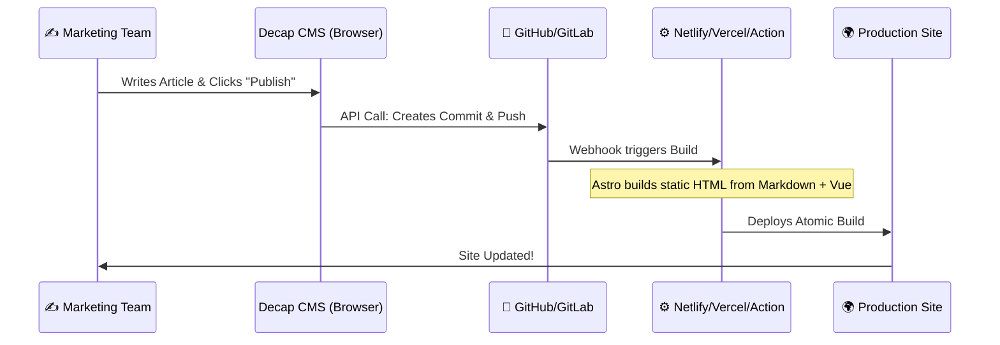
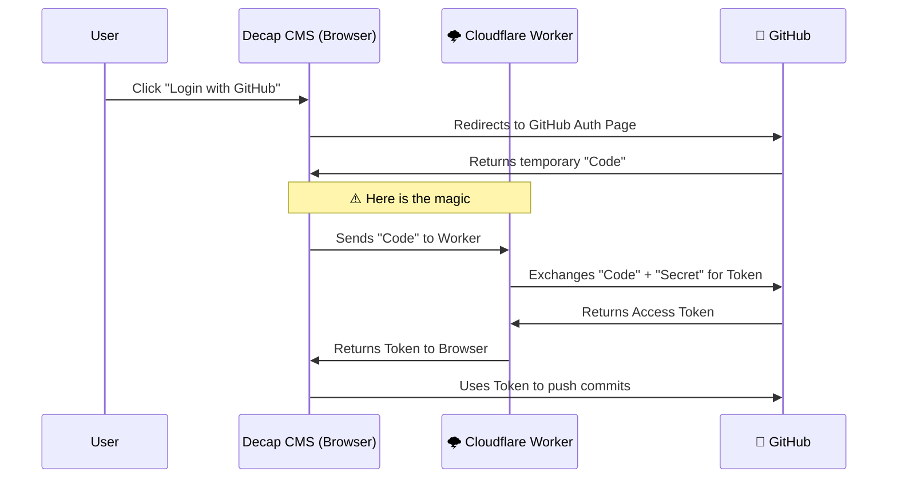
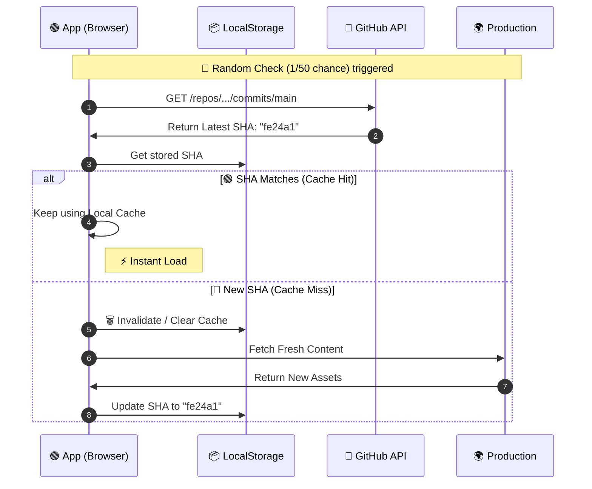

---
# try also 'default' to start simple
theme: seriph
# random image from a curated Unsplash collection by Anthony
# like them? see https://unsplash.com/collections/94734566/slidev
background: https://cover.sli.dev
# some information about your slides (markdown enabled)
title: Aim pro website
info: |
  ## Building a "WordPress-Killer" with Astro, Vue, and Decap CMS

# apply UnoCSS classes to the current slide
class: text-center
# https://sli.dev/features/drawing
drawings:
  persist: false
# slide transition: https://sli.dev/guide/animations.html#slide-transitions
transition: slide-left
# enable MDC Syntax: https://sli.dev/features/mdc
mdc: true
# duration of the presentation
duration: 35min
---


# The Modern Web Triad

## Building a "WordPress-Killer" with Astro, Vue, and Decap CMS

<br>

### Unifying Dev Experience (DevX) and Editor Experience (UX), and Ops Performance with Smart Client-Side Caching


---

# 1. The Eternal Conflict

<div class="grid grid-cols-2 gap-4">

<div>

### 🧑‍💻 The Developer
*   Wants **Performance** (Lighthouse 100/100).
*   Wants **Security** (No SQL injections).
*   Wants **Git** (Version control, branches).
*   **Hates** maintaining PHP servers & plugins.

</div>

<div>

### ✍️ The Content Editor
*   Wants **Autonomy** (Don't call IT to fix a typo).
*   Wants **Visuals** (WYSIWYG).
*   Wants **Media Management** (Drag & drop).
*   **Hates** seeing Markdown or raw HTML.

</div>

</div>

<br>

> **Usually, the solution is often driven by Content Editor, i.e. WordPress.**
>
> *Result: Devs are sad, Site is slow, Security is a risk.*

---

# 2. The dev solution: A Jamstack

The modern way to build Websites and Apps that delivers better performance

---
title: What is Jamstack?
level: 1
---


# What is Jamstack?

- Jamstack is an architecture designed to make the web **faster**, more **secure**, and **easier to scale**.

- It builds on many of the tools and workflows which developers love, and which bring maximum productivity.

- The core principles of pre-rendering, and decoupling, enable sites and applications to be delivered with greater confidence and resilience than ever before.

---
hideInToc: true
layout: two-cols

# a custom class name to the content
class: my-cool-content-on-the-left
---

# The future is highly distributed

- [Jamstack](https://jamstack.org/) is the new standard architecture for the web. Using Git workflows and modern build tools, pre-rendered content is served to a CDN and made dynamic through APIs and serverless functions. It is for example easy to use github actions to build and deploy the front. Technologies in the stack include JavaScript frameworks, Static Site Generators, Headless CMSs, CI/CD and CDNs.

- The work was done during the build, so now the generated site is stable and can be hosted without servers which might require patching, updating and maintain.

::right::

<div class="flex items-center justify-center h-full all:transition-400">

</div>


---
layout: two-cols
# the web page source
# a custom class name to the content
class: my-cool-content-on-the-left
title: Why Jamstack?
level: 1
---

# Why Jamstack 1/6?

### Security

- The Jamstack removes multiple moving parts and systems from the hosting infrastructure resulting in fewer servers and systems to harden against attack.

- Serving pages and assets as pre-generated files allows read-only hosting reducing attack vectors even further. Meanwhile dynamic tools and services can be provided by vendors with teams dedicated to securing their specific systems and providing high levels of service.

::right::

<div class="flex items-center justify-center h-full all:transition-400">

</div>


---
hideInToc: true
layout: two-cols
---

# Why Jamstack 2/6?

### Scale

- Popular architectures deal with heavy traffic loads by adding logic to cache popular views and resources. The Jamstack provides this by default. When sites can be served entirely from a CDN there is no complex logic or workflow to determine what assets can be cached and when.

- With Jamstack sites everything can be cached in a content delivery network. With simpler deployments, built-in redundancy and incredible load capacity.

::right::

// 


---
hideInToc: true
layout: two-cols
class: my-cool-content-on-the-left
---

# Why Jamstack 3/6?

### Performance

- Page loading speeds have an impact on user experience and conversion. Jamstack sites remove the need to generate page views on a server at request time by instead generating pages ahead of time during a build.

- With all the pages are already available on a CDN close to the user and ready to serve, very high performance is possible without introducing expensive or complex infrastructure.

::right::


---
hideInToc: true
layout: two-cols
---

# Why Jamstack 4/6?

### Maintainability

- When hosting complexity is reduced, so are maintenance tasks. A pre-generated site, being served directly from a simple host or directly from a CDN does not need a team of experts to "keep the lights on".

- The work was done during the build, so now the generated site is stable and can be hosted without servers which might require patching, updating and maintain.

::right::


---
hideInToc: true
layout: two-cols
class: my-cool-content-on-the-left
---

# Why Jamstack 5/6?

### Portability

- Jamstack sites are pre-generated. That means that you can host them from a wide variety of hosting services and have greater ability to move them to your preferred host. Any simple static hosting solution should be able to serve a Jamstack site.

- Bye-bye infrastructure lock-in.

::right::


---
hideInToc: true
layout: two-cols
class: my-cool-content-on-the-left
---

# Why Jamstack 6/6?

### Developer Experience

- Jamstack sites can be built with a wide variety of tools. They do not depend on the proprietary technologies or exotic and little known frameworks. Instead, they build on widely available tools and conventions. As a result, it's not hard to find enthusiastic and talented developers who have the right skills to build with the Jamstack. Efficiency and effectiveness can prosper.

::right::


---
layout: center
class: text-center
---


# **Results with Jamstack**

> *Result: Devs are happy, end users does not know git, github, markdown, html, asciidoc, they are sad*

<div class="flex items-center justify-center h-full all:transition-400">

</div>

---

# 3. The Solution: A Modern Stack

We can reconcile both worlds by combining:

1.  **The Engine:** **Astro** (Static Site Generator) + **Vue.js** (Interactive Components).
2.  **The Database:** **Git** (Content as Code).
3.  **The Interface:** **Decap CMS** (formerly Netlify CMS).
4.  **The Ops:** **CI/CD** (Automated Deployments).


---
hideInToc: true
layout: two-cols
class: my-cool-content-on-the-left
---

# 4. The Interface: Decap CMS 📝


**Decap CMS** is a Single Page App that acts as a wrapper around your Git workflow.

*   **WYSIWYG:** Editors see a clean form (Title, Body, Image).
*   **Git-Based:** When they click "Save", it creates a **Commit** to the repository.
*   **No Backend:** It talks directly to the GitHub/GitLab API.

> *To the editor, it looks like WordPress. To the repository, it looks like a Developer pushing code.*

::right::


---


# 5. The DevOps Flow (Architecture)



---

# 6. The Engine: Astro + Vue 🚀

### Why Astro?
*   **Zero JS by Default:** Ships HTML only.
*   **Islands Architecture:** Hydrate interactive components only where needed.
*   **Content Collections:** Type-safe markdown handling.

### Why Vue?
*   **Interactivity:** Used inside Astro "Islands" for complex UI (Search, Maps, Forms).
*   **Ecosystem:** Leverage existing Vue libraries.

```html
<!-- Example: Astro Page -->
---
import Header from '../components/Header.astro';
import InteractiveCalculator from '../components/Calculator.vue';
---
<Header />
<!-- Vue loads only for this specific component -->
<InteractiveCalculator client:visible />
```

---


# 7. Behind the scene. Connecting the Dots...

How Decap "talks" to Astro content collections.

**1. `admin/config.yml` (Decap)**
```yaml
collections:
  - name: "blog"
    label: "Blog"
    folder: "src/content/blog" # Where Astro looks for content
    create: true
    fields:
      - {label: "Title", name: "title", widget: "string"}
      - {label: "Body", name: "body", widget: "markdown"}
```

**2. `src/content/config.ts` (Astro)**
```typescript
const blogCollection = defineCollection({
  type: 'content',
  schema: z.object({
    title: z.string(),
    // Astro validates the schema enforced by Decap
  }),
});
```

---

# 8. Why this Stack Wins 🏆

| Feature | WordPress / Monolith | Astro + Vue + Decap |
| :--- | :--- | :--- |
| **Performance** | Server-side processing (Slower) | **Pre-rendered Static HTML (Instant)** |
| **Security** | SQL Database + Plugins surface | **No Database, No Server (Un-hackable)** |
| **Versioning** | Hard to revert database changes | **Git Time Machine (Rollback in seconds)** |
| **Cost** | Needs Hosting + DB ($$) | **Static Hosting (Free/Cheap)** |
| **DX** | PHP, legacy code | **Modern JS/TS, Vue, Components** |

---

# 9. Aim-Pro Website demo [🌍](https://aim-pro-eu.github.io)


---

# 9. Aim-Pro Website demo [🌍](https://aim-pro-eu.github.io)


---

# 9. Aim-Pro Website demo [🌍](https://aim-pro-eu.github.io)


---

# 9. Aim-Pro Website demo [🌍](https://aim-pro-eu.github.io)


---

# 9. Aim-Pro Website demo [🌍](https://aim-pro-eu.github.io)


---

# 9. Aim-Pro Website demo [🌍](https://aim-pro-eu.github.io)


---

# 10. The Missing Piece: Authentication 🔐

Wait... if there is **no server**, how do we log in securely?

### The Challenge
1.  **OAuth 2.0 requires a secret:** To authenticate with GitHub, we need a `CLIENT_SECRET`.
2.  **Client-side is insecure:** We cannot store this secret in the Vue/Astro code (it would be public).
3.  **Vendor Lock-in:** Netlify offers "Netlify Identity", but what if we want to host on Cloudflare Pages, Vercel, or AWS?

> **We need a tiny, invisible backend just for the handshake.**

---

# 10. The Solution: Cloudflare Workers 🌩️

We use a lightweight **Serverless Function** to handle the OAuth "Dance".

### Based on `sterlingwes/decap-proxy`

*   **Architecture:** A minimal script running on Cloudflare's Edge Network.
*   **Role:** It acts as the "middleman" between Decap CMS and GitHub.
*   **Cost:** Virtually free (runs only during login).
*   **Speed:** < 10ms execution time.

> It replaces the need for a full auth server or Netlify Identity.

---

# 10. The Auth Flow (Under the Hood)



---

# 10. Implementation Details 🛠️

How to wire it up in your project.

**1. Deploy the Worker**
Clone `sterlingwes/decap-proxy`, add your GitHub `CLIENT_ID` and `CLIENT_SECRET` to Cloudflare environment variables, and deploy.

**2. Configure Decap (`admin/config.yml`)**
Tell Decap to use your custom backend instead of the default.

```yaml
backend:
  name: github
  repo: your-name/your-project
  branch: main
  # ⬇️ The URL of your Cloudflare Worker
  base_url: https://auth.your-domain.com 
  auth_endpoint: auth
```

<div class="h-10"></div>


> **Result:** A secure, serverless authentication flow that you fully control.


---
layout: two-cols
title: Smart Caching Strategy
---

# 11. Smart Caching 🧠

### The "Git-Aware" Client Strategy:


1.  **Optimistic UI:** By default, serve content immediately from **LocalStorage** if it has cache value.
2.  **The "Heartbeat" Check:** Periodically (e.g., 1 out of XX loads), the app queries the **GitHub API** to get the latest commit SHA.
3.  **Atomic Invalidation:**
    *   **SHA matches LocalStorage?** Do nothing. Continue serving cache.
    *   **New SHA detected?** 🚨 **Purge** LocalStorage, fetch fresh content, update the stored SHA.

> *Result: Near-instant loads for 98% of visits, with guaranteed freshness when it matters.*


::right::



We don't rely on standard browser caching headers alone. We proactively check the **Source of Truth**: GitHub.


---


# 12. Conclusion

### "The Jamstack Maturity"

We are no longer choosing between **Developer Happiness** and **Client Autonomy**.

By using **Decap CMS** as a bridge and **Astro + Vue** as the engine, we treat **Content as Code**.

*   ✅ Editors get their comfortable UI.
*   ✅ Developers get their modern Git workflow.
*   ✅ Users get the fastest website possible using cache.

---

<!-- .slide: class="text-center" -->

# Thank You!

## Q&A

💻 github.com/aim-pro-eu/aim-pro-eu.github.io

🌍 https://aim-pro-eu.github.io
